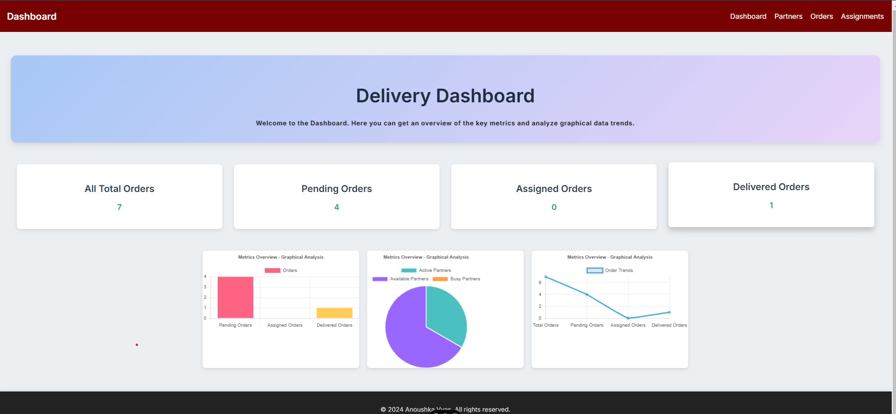

# Smart Delivery Management System

## Overview

The Smart Delivery Management System is designed to streamline and optimize the delivery process by focusing on partner management and smart order assignments. The system provides a modern dashboard that allows businesses to efficiently track and manage delivery partners, orders, and assignments. It also provides key performance metrics to monitor the effectiveness of delivery operations.

## Features

### 1. **Partner Management**
   - **Partner List View:** View a list of all registered delivery partners.
   - **Area Management:** Manage delivery areas for each partner.
   - **Shift Scheduling:** Assign shifts to each partner, specifying their start and end times.

### 2. **Order Processing**
   - **Orders Dashboard:** View all orders with their current status (pending, assigned, picked, delivered).
   - **Status Tracking:** Track the status of each order throughout the delivery process.
   - **Performance Metrics:** Monitor performance metrics for both delivery partners and orders, including completed, cancelled, and success rates.

### 3. **Assignment System**
 Track assignment success/failure rates and analyze reasons for failures.

### 4. **Tech Stack**
The Smart Delivery Management System is built with the following technologies:

View API Documentation in the backend directory.

Frontend:
React: A JavaScript library for building user interfaces.

Backend:
Node.js: A JavaScript runtime used for server-side development.
Express: A web framework for Node.js used to build the API routes.
MongoDB: A NoSQL database used for storing delivery partners, orders, and assignments.
